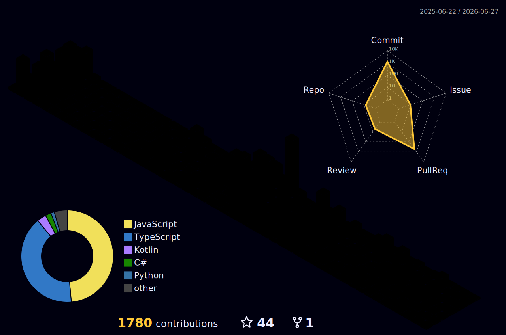

# Hello! 👋
<!-- ##  -->
<!-- [](https://wakatime.com/@d737cf58-0abb-4401-8dfa-0a639be02013) -->

<p align="center"><a href="https://git.io/streak-stats"></a></p>

<!--START_SECTION:waka-->


**🐱 My GitHub Data** 

> 📦 917.3 kB Used in GitHub's Storage 
 > 
> 🏆 832 Contributions in the Year 2026
 > 
> 🚫 Not Opted to Hire
 > 
> 📜 20 Public Repositories 
 > 
> 🔑 1 Private Repositories 
 > 
**I'm a Night 🦉** 

```text
🌞 Morning                526 commits         ██░░░░░░░░░░░░░░░░░░░░░░░   06.48 % 
🌆 Daytime                2302 commits        ███████░░░░░░░░░░░░░░░░░░   28.35 % 
🌃 Evening                3065 commits        █████████░░░░░░░░░░░░░░░░   37.75 % 
🌙 Night                  2227 commits        ███████░░░░░░░░░░░░░░░░░░   27.43 % 
```
📅 **I'm Most Productive on Tuesday** 

```text
Monday                   992 commits         ███░░░░░░░░░░░░░░░░░░░░░░   12.22 % 
Tuesday                  1797 commits        ██████░░░░░░░░░░░░░░░░░░░   22.13 % 
Wednesday                627 commits         ██░░░░░░░░░░░░░░░░░░░░░░░   07.72 % 
Thursday                 1474 commits        █████░░░░░░░░░░░░░░░░░░░░   18.15 % 
Friday                   532 commits         ██░░░░░░░░░░░░░░░░░░░░░░░   06.55 % 
Saturday                 1196 commits        ████░░░░░░░░░░░░░░░░░░░░░   14.73 % 
Sunday                   1502 commits        █████░░░░░░░░░░░░░░░░░░░░   18.50 % 
```


📊 **This Week I Spent My Time On** 

```text
🕑︎ Time Zone: Europe/Moscow

💬 Programming Languages: 
TypeScript               41 hrs 48 mins      █████████████████████░░░░   83.70 % 
JSON                     4 hrs 4 mins        ██░░░░░░░░░░░░░░░░░░░░░░░   08.16 % 
JavaScript               1 hr 9 mins         █░░░░░░░░░░░░░░░░░░░░░░░░   02.31 % 
Git Config               34 mins             ░░░░░░░░░░░░░░░░░░░░░░░░░   01.16 % 
CSS                      34 mins             ░░░░░░░░░░░░░░░░░░░░░░░░░   01.15 % 

🔥 Editors: 
VS Code                  49 hrs 57 mins      █████████████████████████   100.00 % 

🐱‍💻 Projects: 
web                      49 hrs 57 mins      █████████████████████████   100.00 % 

💻 Operating System: 
Windows                  49 hrs 57 mins      █████████████████████████   100.00 % 
```

**I Mostly Code in C#** 

```text
C#                       8 repos             █████████░░░░░░░░░░░░░░░░   36.36 % 
JavaScript               6 repos             ███████░░░░░░░░░░░░░░░░░░   27.27 % 
TypeScript               2 repos             ██░░░░░░░░░░░░░░░░░░░░░░░   09.09 % 
Python                   2 repos             ██░░░░░░░░░░░░░░░░░░░░░░░   09.09 % 
Kotlin                   1 repo              █░░░░░░░░░░░░░░░░░░░░░░░░   04.55 % 
```


**Timeline**


 Last Updated on 06/04/2026 19:39:09 UTC
<!--END_SECTION:waka-->

---

### 🌃 My Coding City
<p align="center">
  
</p>

### 📊 Full Analysis
<p align="center">
  
</p>

### 🐍 Contribution Snake
<p align="center">
  
</p>
