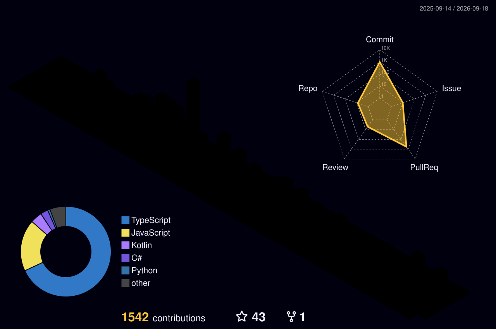

# Hello! 👋
<!-- ##  -->
<!-- [](https://wakatime.com/@d737cf58-0abb-4401-8dfa-0a639be02013) -->

<p align="center"><a href="https://git.io/streak-stats"></a></p>

<!--START_SECTION:waka-->


**🐱 My GitHub Data** 

> 📦 655.7 kB Used in GitHub's Storage 
 > 
> 🏆 996 Contributions in the Year 2026
 > 
> 💼 Opted to Hire
 > 
> 📜 20 Public Repositories 
 > 
> 🔑 1 Private Repositories 
 > 
**I'm a Night 🦉** 

```text
🌞 Morning                951 commits         █░░░░░░░░░░░░░░░░░░░░░░░░   03.37 % 
🌆 Daytime                9409 commits        ████████░░░░░░░░░░░░░░░░░   33.31 % 
🌃 Evening                10013 commits       █████████░░░░░░░░░░░░░░░░   35.45 % 
🌙 Night                  7875 commits        ███████░░░░░░░░░░░░░░░░░░   27.88 % 
```
📅 **I'm Most Productive on Sunday** 

```text
Monday                   3643 commits        ███░░░░░░░░░░░░░░░░░░░░░░   12.90 % 
Tuesday                  3236 commits        ███░░░░░░░░░░░░░░░░░░░░░░   11.46 % 
Wednesday                3325 commits        ███░░░░░░░░░░░░░░░░░░░░░░   11.77 % 
Thursday                 4232 commits        ████░░░░░░░░░░░░░░░░░░░░░   14.98 % 
Friday                   3226 commits        ███░░░░░░░░░░░░░░░░░░░░░░   11.42 % 
Saturday                 4319 commits        ████░░░░░░░░░░░░░░░░░░░░░   15.29 % 
Sunday                   6267 commits        ██████░░░░░░░░░░░░░░░░░░░   22.19 % 
```


📊 **This Week I Spent My Time On** 

```text
🕑︎ Time Zone: Europe/Moscow

💬 Programming Languages: 
No Activity Tracked This Week

🔥 Editors: 
No Activity Tracked This Week

🐱‍💻 Projects: 
No Activity Tracked This Week

💻 Operating System: 
No Activity Tracked This Week
```

🤖 **AI Coding This Week** 

```text
No AI Coding Activity Tracked This Week
```

**I Mostly Code in C#** 

```text
C#                       8 repos             ███████░░░░░░░░░░░░░░░░░░   29.63 % 
JavaScript               7 repos             ██████░░░░░░░░░░░░░░░░░░░   25.93 % 
TypeScript               5 repos             █████░░░░░░░░░░░░░░░░░░░░   18.52 % 
Python                   3 repos             ███░░░░░░░░░░░░░░░░░░░░░░   11.11 % 
Kotlin                   1 repo              █░░░░░░░░░░░░░░░░░░░░░░░░   03.70 % 
```


**Timeline**


 Last Updated on 04/08/2026 20:18:11 UTC
<!--END_SECTION:waka-->

---

### 🌃 My Coding City
<p align="center">
  
</p>

### 📊 Full Analysis
<p align="center">
  
</p>

### 🐍 Contribution Snake
<p align="center">
  
</p>
