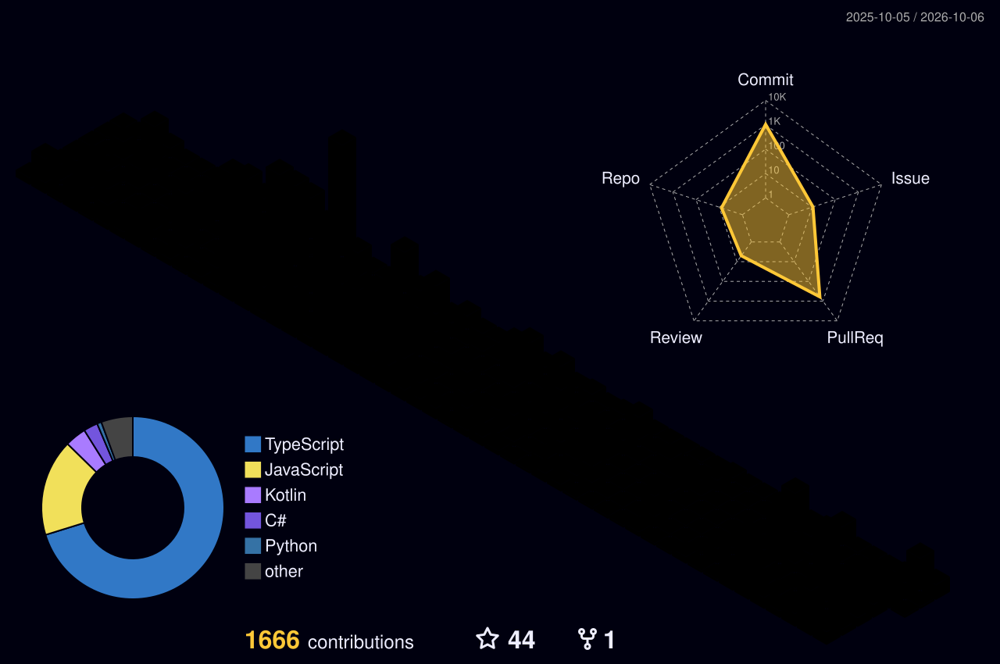

# Hello! 👋
<!-- ##  -->
<!-- [](https://wakatime.com/@d737cf58-0abb-4401-8dfa-0a639be02013) -->

<p align="center"><a href="https://git.io/streak-stats"></a></p>

<!--START_SECTION:waka-->


**🐱 My GitHub Data** 

> 📦 659.4 kB Used in GitHub's Storage 
 > 
> 🏆 1,238 Contributions in the Year 2026
 > 
> 💼 Opted to Hire
 > 
> 📜 23 Public Repositories 
 > 
> 🔑 1 Private Repositories 
 > 
**I'm a Night 🦉** 

```text
🌞 Morning                175 commits         ░░░░░░░░░░░░░░░░░░░░░░░░░   01.06 % 
🌆 Daytime                6512 commits        ██████████░░░░░░░░░░░░░░░   39.50 % 
🌃 Evening                5632 commits        █████████░░░░░░░░░░░░░░░░   34.16 % 
🌙 Night                  4168 commits        ██████░░░░░░░░░░░░░░░░░░░   25.28 % 
```
📅 **I'm Most Productive on Sunday** 

```text
Monday                   1982 commits        ███░░░░░░░░░░░░░░░░░░░░░░   12.02 % 
Tuesday                  1975 commits        ███░░░░░░░░░░░░░░░░░░░░░░   11.98 % 
Wednesday                1326 commits        ██░░░░░░░░░░░░░░░░░░░░░░░   08.04 % 
Thursday                 2719 commits        ████░░░░░░░░░░░░░░░░░░░░░   16.49 % 
Friday                   1450 commits        ██░░░░░░░░░░░░░░░░░░░░░░░   08.79 % 
Saturday                 2291 commits        ███░░░░░░░░░░░░░░░░░░░░░░   13.90 % 
Sunday                   4744 commits        ███████░░░░░░░░░░░░░░░░░░   28.77 % 
```


📊 **This Week I Spent My Time On** 

```text
🕑︎ Time Zone: Europe/Moscow

💬 Programming Languages: 
TypeScript               35 hrs 14 mins      ████████████████░░░░░░░░░   64.41 % 
JSON                     7 hrs 20 mins       ███░░░░░░░░░░░░░░░░░░░░░░   13.42 % 
Python                   3 hrs 27 mins       ██░░░░░░░░░░░░░░░░░░░░░░░   06.31 % 
Markdown                 2 hrs 7 mins        █░░░░░░░░░░░░░░░░░░░░░░░░   03.89 % 
Prisma                   1 hr 22 mins        █░░░░░░░░░░░░░░░░░░░░░░░░   02.51 % 

🔥 Editors: 
VS Code                  54 hrs 42 mins      █████████████████████████   100.00 % 

🐱‍💻 Projects: 
doxynix                  30 hrs 34 mins      ██████████████░░░░░░░░░░░   55.88 % 
test-backend             18 hrs 32 mins      ████████░░░░░░░░░░░░░░░░░   33.90 % 
python                   3 hrs 40 mins       ██░░░░░░░░░░░░░░░░░░░░░░░   06.71 % 
Unknown Project          1 hr 45 mins        █░░░░░░░░░░░░░░░░░░░░░░░░   03.22 % 
voxhold                  9 mins              ░░░░░░░░░░░░░░░░░░░░░░░░░   00.28 % 

💻 Operating System: 
Linux                    54 hrs 42 mins      █████████████████████████   100.00 % 
```

🤖 **AI Coding This Week** 

```text
No AI Coding Activity Tracked This Week
```

**I Mostly Code in TypeScript** 

```text
TypeScript               8 repos             ██████░░░░░░░░░░░░░░░░░░░   25.00 % 
C#                       8 repos             ██████░░░░░░░░░░░░░░░░░░░   25.00 % 
JavaScript               7 repos             █████░░░░░░░░░░░░░░░░░░░░   21.88 % 
Python                   3 repos             ██░░░░░░░░░░░░░░░░░░░░░░░   09.38 % 
Kotlin                   1 repo              █░░░░░░░░░░░░░░░░░░░░░░░░   03.12 % 
```


**Timeline**


 Last Updated on 27/09/2026 21:46:10 UTC
<!--END_SECTION:waka-->

---

### 🌃 My Coding City
<p align="center">
  
</p>

### 📊 Full Analysis
<p align="center">
  
</p>

### 🐍 Contribution Snake
<p align="center">
  
</p>
